# Networks

## Terminology

1. **Payload**: Data being sent. eg: pdf, image, video etc.  
2. **Internet**: Infrastructure that ties together computing devices. eg: TCP, IP, BGP, DNS, OSPF(Open Shortest Path First)  
3. **Links**: Interconnection between entities. eg: Wireless -> Cellular 4G/5G, wifi 802.11, bluetooth, satellite. Wired -> Ethernet, Fiber optics, Copper cable, Coaxial cable  
4. **MAC Address**: Every endpoint has a link level address and packets(bits of data being sent) have this destination address on them. eg: 00:1A:2B:3C:4D:5E  
5. **Switching**: What a router does, physically move data from one link to another
6. **Packet Size** - Length of packet(bits/bytes) including header and data
7. **Bandwidth** - For a single link, amount of data it can transmit per unit time(bits/second or Byes/second or packets/second)  
8. **Propagation Delay** - Time taken for a bit to move across. Imposed by the length of a link(limited by the communication medium)
9. **Transmission Delay** - Time from first bit@ sender to last bit @ sender. Determined by link bandwidth and packet size
10. **Queuing Delay** - Time spent in router buffer. Time that a packet waits for transmission. Determined by contention for the link
11. **Total Packet Delay** - Time from first bit @ sender to last bit @ receiver. Sum of all delays
12. **Throttling** - Limiting the rate of data transfer
13. **Jitter** - Variation in delay
14. **Packet Loss** - Packets are dropped due to buffer overflow
15. **Throughput** - Rate at which data is transferred
16. **Latency** - Time taken for a packet to travel from sender to receiver
17. **Network**: Carrier of information between two entities(maybe hosts/endpoints/routers)
18. **Critical Nodes**: If a node is down, the whole network is down. You cant get from atleast one node to another
19. **Critical Links**: If a link is down, the network is down. You cant get from atleast one node to another
20. **Good Put**: Application Layer/Transport Later Throughput(rate at which application is able to get data in ordered manner)

## Random Facts

- MTU(Maximum Transmission Unit) is the largest size of a protocol data unit (PDU) that can be transmitted over a network without fragmentation
- IP fragmentation occurs when a packet is larger than the MTU of a network it is traversing
  - Each fragment contains a copy of the original IP header with modifications.
- 1514B is the value of one packet
- MSS(Maximum Segment Size) = 1448B
- ECN - Explicit Congestion Notification flag
- Cyclic redundancy check (CRC)
  - Error detection mechanism
  - Sender and receiver agree on a polynomial
  - Sender divides the data by the polynomial and sends the remainder
  - Receiver divides the data by the polynomial and checks if the remainder is 0
  - If the remainder is not 0, there is an error
  - CRC done in Ethernet layer(hardware)
- RIPE ATLAS is a project that builds the map of the internet
- TCP was developed by Vint Cerf and Bob Kahn in the 1970s
- DHCP is an application layer protocol that uses the IP infrastructure to allot IPs
- DNS does not use TCP as it needs 6 7 packets to establish a connection. It uses UDP as it is faster
- Streaming vs Store-and-Forward: How they work?
  - Streaming: As soon as the packet is received, it is processed and forwarded
  - Store-and-Forward: The packet is stored in a buffer and then forwarded. The receiver processes the packet only after it has been fully received
- ARP takes care of routing at the link layer
  - Tracing back to an IP: A table is needed that maps an IP to a MAC.
  - ARP handled by the OS. Creating frames is handled by the NIC
- ARP cache poisoning
  - To go from IP to MAC address, a device sends a request asking for who has an IP address of _Some IP_ and the device with that IP responds also mentioning its MAC address
  - False messages are sent in the network with the attacker's MAC address and another legitimate device's IP address
  - This results in the wrong MAC being mapped for a specific IP and whenever the victim tries to communicate with the legitimate device, it sends the traffic to the attacker instead
- DHCP(Dynamic Host Configuration Protocol) - Which assigns the IP to your system(162.blahblah)
- DASH - Dynamic Adaptive Streaming over HTTP
  - Used for adaptive bitrate streaming of media content (such as video and audio) over the Internet using standard HTTP web servers

## Problems

This elementary problem begins to explore propagation delay and transmis-
sion delay, two central concepts in data networking. Consider two hosts, A
and B, connected by a single link of rate R bps. Suppose that the two hosts
are separated by m meters, and suppose the propagation speed along the link
is s meters/sec. Host A is to send a packet of size L bits to Host B.
a. Express the propagation delay, dprop, in terms of m and s.
b. Determine the transmission time of the packet, dtrans, in terms of L and R.
c. Ignoring processing and queuing delays, obtain an expression for the end-
to-end delay.
d. Suppose Host A begins to transmit the packet at time t = 0. At time t =
dtrans, where is the last bit of the packet?
e. Suppose dprop is greater than dtrans. At time t = dtrans, where is the first
bit of the packet?
f. Suppose dprop is less than dtrans. At time t = dtrans, where is the first bit of
the packet?
g. Suppose s = 2.5 # 108, L = 1500 bytes, and R = 10 Mbps. Find the
distance m so that dprop equals dtrans.

Suppose users share a 10 Mbps link. Also suppose each user requires 200 kbps
when transmitting, but each user transmits only 10 percent of the time. (See
the discussion of packet switching versus circuit switching in Section 1.3.)
a. When circuit switching is used, how many users can be supported?
b. For the remainder of this problem, suppose packet switching is used. Find
the probability that a given user is transmitting.PROBLEMS
c. Suppose there are 120 users. Find the probability that at any given time,
exactly n users are transmitting simultaneously. (Hint: Use the binomial
distribution.)
d. Find the probability that there are 51 or more users transmitting
simultaneously.

Suppose users share a 2 Mbps link. Also suppose each user transmits contin-
uously at 1 Mbps when transmitting, but each user transmits only 20 percent
of the time. (See the discussion of statistical multiplexing in Section 1.3.)
a. When circuit switching is used, how many users can be supported?
b. For the remainder of this problem, suppose packet switching is used. Why
will there be essentially no queuing delay before the link if two or fewer
users transmit at the same time? Why will there be a queuing delay if
three users transmit at the same time?
c. Find the probability that a given user is transmitting.
d. Suppose now there are three users. Find the probability that at any given
time, all three users are transmitting simultaneously. Find the fraction of
time during which the queue grows.

eg: At a customer service counter, an operator has on average 4 customers
and on an average 2 customers arrive every 3 minutes. What is the average
waiting time of a customer?  

L = 4, A = 2/3 = 0.67. Hence, W = 4/0.67 = 6 minutes

eg:  
A network router processes packets at an average arrival
rate of 200 packets per second. The average time a packet spends in the
system (queue + packet processing) is 0.01 seconds. Calculate the
average number of packets in the router's buffer.  

A = 200 packets/s, W = 0.01s. Hence, L = 200 * 0.01 = 2 packets  

eg:  
A network switch has an average of 10 packets in the
system, and each packet spends an average of 0.05 seconds in the
system. Determine the arrival rate.

A = 10/0.05 = 200 packets/s

eg:  
Packets of size 1000 bits are being sent each across a network path from Chennai to Kolkata.
The one-way delay varies between 50 ms (in the absence of any queueing) and 125 ms (full queue), with an average of 75 ms.
The transmission rate at the sender is 1 Mbit/s(A); the receiver gets packets at the same rate without any packet loss.
What is the average length of the queue in the bottleneck link along the path?
(consider that queuing happens only in one switch)

Propagation delay = 75 ms
Queueing delay = 75 - 50 = 25 ms = W
Average number of packets in the queue = 1 Mbit/s * 25 ms = 25 bits

## Introduction

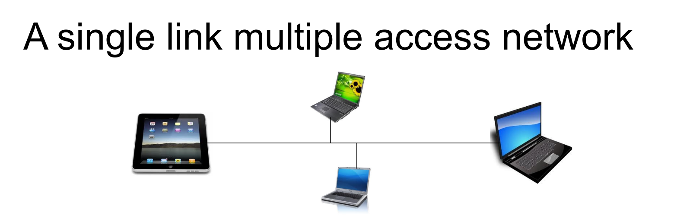

Even on a single link:

1. Need to convert digital data to physical signals over the medium(encode/decode)
2. Need to decide who speaks when(multiple access)
3. Detect and correct errors

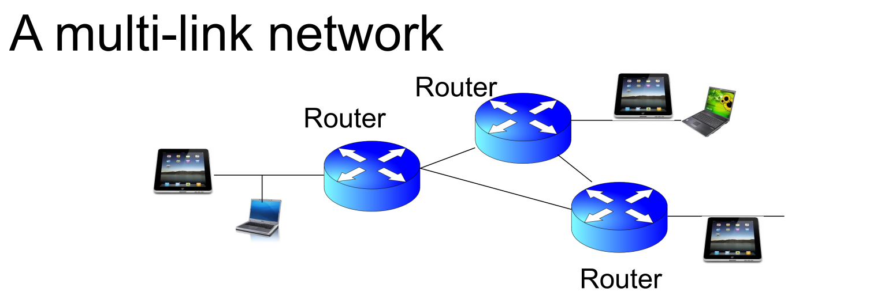

- Connect multiple links via routers -> _Routing Problem_ needs to be solved
- Packets may be lost, corrupted or reordered on the way to the destination(Best Effort Delivery)
- Need to solve _reliable data delivery_ problem and _ordered delivery_
- Need to know how data should be sent from endpoints(congestion problem). How to vary the sending rate based on network signals
- How should router transmit packets when network resources are the scarce(Packet scheduling)(Buffer Management)
- We get 20-30x inflation with respect to C speed. How to handle this?
- Transmission happens through physical signals(analog, light AC voltage)
- Converting bits to signals through modulation and vice versa through demodulation

## Circuit Switching

1. Source sends a reservation request to the destination
2. Routers establish a path between the source and destination (A circuit)
3. Source sends data to the destination
4. When the data is sent, the circuit is torn down
5. THERE ARE NO PACKETS IN CIRCUIT SWITCHING
6. Used in telephones
7. Unix was developed in Bell labs for time sharing of packets

Pros:

- Predictable performance
- Simple and fast switching once the circuit is established

Cons:

- Circuit setup adds delay
- Inefficient when traffic is bursty
- Complexity of circuit setup/teardown
- Fault tolerance is bad, if there is a fault in the circuit, the whole circuit is down and a new one needs to be established. You cant route around the fault like packet switching
- Causes frequent overloading of the network

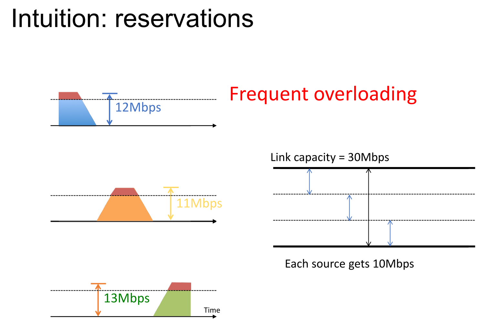

Types of circuits:

- Time division multiplexing
  - Divide in time slots, to serve separate time slot per circuit. Like t=0 to t=1, t=1 to t=2 .....
  - Round robin scheduling happens
  - In telephone, cellular(LTE)

- Frequency division multiplexing
  - Divide in frequency bands
  - Each user has exclusive possession of some band
  - Used in terrestrial wireless and satellite networks
  - When few users are communicating than numbe of channels available, bandwidth is wasted

- Wifi uses Wave DM which is a combination of Time and Frequency divisino multiplexing

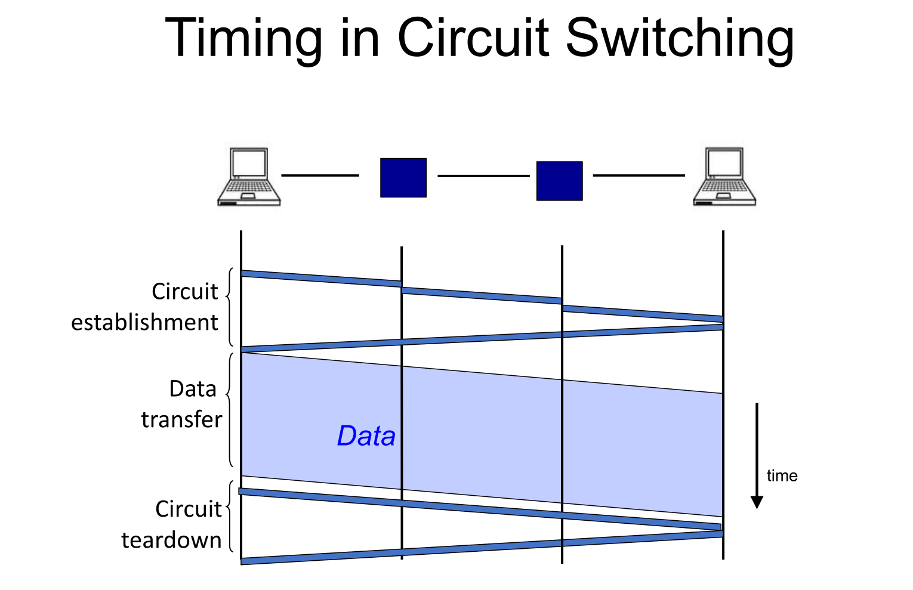

- Discontinuity due to decision making at routers, once this is done, return to source is faster and continuous
- Blue coloured part should be as full as possible to maximize pipe usage

## Packet Switching

- Each packet contains a destination address
- Modelled after the postal system
- Each packet is treated independently
- Routers store packets if they are too much to handle and then forward them later on (Buffer). They can handle transient overloads
- The INTERNET uses store-and-forward packet switching. For big packets it takes too long.
  - Wait for the entire message to arrive before sending it onto the next node
  - Allows the bursty traffic to smoothen out by storing it in a queue before sending it forward

Pros:

- Efficient use of network resources
- Exploits statistical multiplexing better than circuit switching
- Good for bursty traffic(average << peak demand)
- Simpler to implement
- Robust, as they can route around failure

Cons:

- Unpredictable performance
- Requires buffer management and congestion control

## Differences between Circuit and Packet Switching

- Packets treated on demand vs Resources reserved per active connection
- Admission control: per packet vs per connection

## Hybrid

Virtual Circuits - Emulating circuit switching with packets

## Layering

- Levels of abstraction: Protcol Layering
- Provides modularity, separates responsibilities and simplifies testing, maintaining and understanding
- Defined contract across layers - Easy to improve or replace protocol at one layer without affecting others
- Each layer provides services to the layer above it and depends on the layer below it
- No data are directly transferred from layer _n_ on one machine to layer _n_ on another machine.
- The interfaces between layers are well-defined and standardized
- We try to minimize the amount of data transferred between layers
- Each packet takes on headers(extra information) at each layer when being sent, and each header is stripped off at the corresponding layer when being received
- Routers have only network and link layers
- Functionality is implemented in the form of protocols

- `Physical Layer`
  - Transmits raw bits over the communication channel
  - Concerns:
    - How many nanoseconds does it take to send a bit?
    - Can the transmission proceed in both directions?
    - What electrical signals to be used to send the bits?
    - How many pins does the network connector have?
- `Link Layer`
  - Best effort local packet delivery
  - Deals with Port numbers
  - Switches operate on this layer
  - Deals with Medium Access Control
- `Network Layer`
  - Best effort global packet delivery
  - Deals with IP Addresses
  - Routers operate on this layer routing packets from source ot destination
  - Might also deal with too large packets, inconsistent addressing and protocols
- `Transport Layer`
  - Reliable end-to-end byte stream
  - Ordered delivery of packets
  - Duplicate packets identified and Missing packets retransmitted.
- **Application Layer**: User services. Only understand payloads

- HTTP is an application layer protocol. Address length less than 8kB
- TCP is a transport layer protocol. Address length = 20B
- IP address length(Network Layer) = 20B
- CRC Checksum length = 4
- SWITCH is link layer and ROUTER is network layer

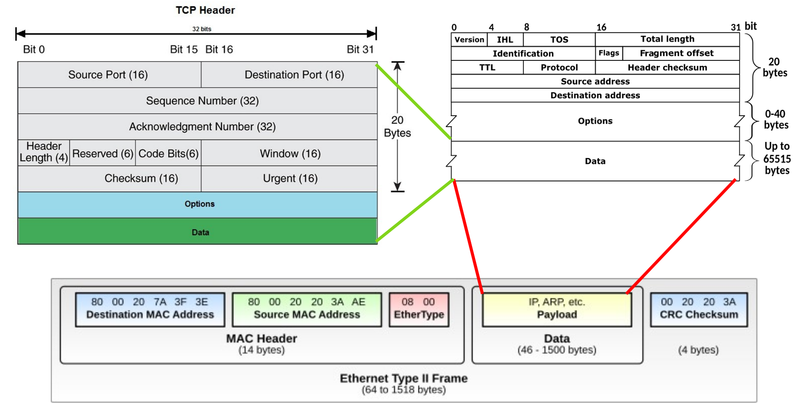

## Protocols

Standardized by the Internet Engineering Task Force (IETF) through RFCs (Request for Comments)
Consists of:

### Message Format

Structure of messages exchanged with an endpoint. Like a function signature(accepting type and returning type)  

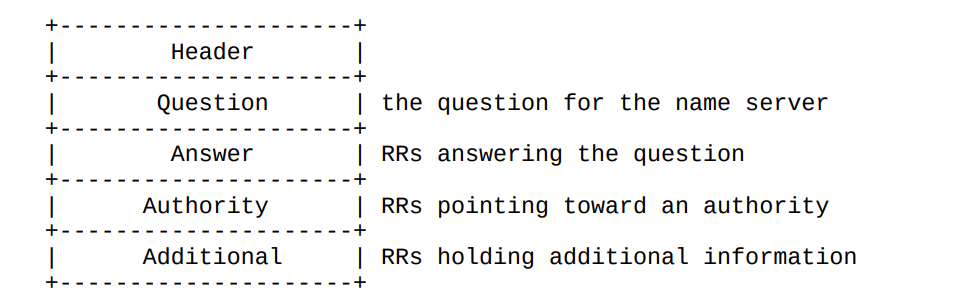

- The _header_ section is always present and it includes fields that specify which of the remain sections are present and also specify whether the message is a query or a response(Type of query/OPCODE)
- The _question_ section includes the query that is being made. May include fields of query type(QTYPE), query class(QCLASS) and query domain(QNAME)
- The las three sections have the same format: a possibly empty list of concatenated resource records(RRs).
  - The answer section contains RRs that answer the question
  - The authority section contains records that point to the authoritatvie nema server
  - The additional records section contain RRs related to the query but does not strictly answer the question

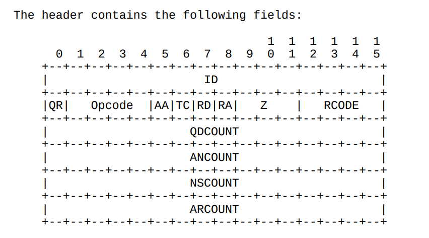

- ID: A 16-bit identifier assigned by the program that generates any kind of query. This identifier is copied the corresponding reply and can be used by the requester to match up replies to outstanding queries
- QR: A one-bit field that specifies whether this message is a query(0) or a response(1)
- OPCODE: A four-bit field that specifies kind of query in this message. This value is set by the originator of a query and copied into the response
- AA: Authoritative Answer - Specifies that the responding name server is an authority for the domain name in the question section
- TC: TrunCation - Specifies that this message was truncated due to length greater than that permitted on the transmission channel
- RD: Recursion Desired - In a query, this bit is set if the client wants the server to recursively query other servers if it does not have the information
- RA: Recursion Available - In a response, this bit is set if the server supports recursive queries
- Z: Reserved for future use. Must be zero in all queries and responses
- RCODE: Response code - 4-bit field that specifies the response code. 0 is no error
- QDCOUNT: An unsigned 16-bit integer specifying the number of entries in the question section
- ANCOUNT: An unsigned 16-bit integer specifying the number of resource records in the answer section
- NSCOUNT: An unsigned 16-bit integer specifying the number of name server resource records in the authority records section
- ARCOUNT: An unsigned 16-bit integer specifying the number of resource records in the additional records section

!!!!!!!!!!!!!!!!!!!!!!!!!!!!!!!!!!!!!!!!!!!!!!!!!!!!!!!!!! INCOMPLETE !!!!!!!!!!!!!!!!!!!!!!!!!!!!!!!!!!!!!!!!!!!!!!!!!!!!!!!!!!!!!!!1

**Actions**: Operations upon receiving or not reeiving messages. Like a function body

eg:  
Message format: English words and sentences  
Actions: When a word is heard, say "yes" when nothing is heard for more than 3 seconds say "can you hear me?"  

Parts of an Address:

1. Application Address/URL(mail.google.com): URL of the application
2. Transport Address/Port(64058): With which application to communicate?
3. Network Address/IP Address(192.168.1.4): Whose network am I on?
4. Hardware Address/MAC Address(00:1A:2B:3C:4D:5E): How do I identify my network interface(device)?

Reliable transport layer on top of unreliable internet layer

## Domain Name System(DNS)

Label that defines a realm of administrative autonomy. eg: google.com, facebook.com, iitm.ac.in, mit.edu

- Domain Names are variable length, mnemonic, carry no information to help, route packets towards them
- But IP addresses are fixed length, hierarchical, and carry routing information
- The DNS service converts hostnames/domains to IP addresses
- *Host aliasing* - Multiple domain names can point to the same IP address
  - <www.facebook.com>(alias hostname), <star.c10r.facebook.com>(canonical hostname)
- Load distribution done by DNS. One domain name can point to multiple IP addresses
  - CDNs(Content Distribution Networks) use this to distribute load, cache content closer to the user

### Implementing a simple DNS

- /etc/hosts.txt file contains the mapping of domain names to IP addresses. But what happens if an endpoint changes its IP address?

- Or implement a server that looks up a table
  - Every new change needs to be entered into this table
  - Performance: Can the server serve billions of Internet users?
  - Failure: What is the server or database crashes?
  - How to secure the server?

### DNS Protocol

- Client-server application
- Client connects to known port 53 of the server using UDP
- Assume DNS server IP is known
- Two types of messages:
  - Queries
  - Responses
- Each type has a common message format that follows the header
- Type of query (OPCODE)
  - Standard Query (0x0): Request IP address for a given domain name
  - Updates (0x5): Update the binding of IP address to a domain name

- When client wants to know the IP address for a domain name:
  - Client sends a DNS query to the *local* nameserver in its network
  - If name server contains the mapping, it returns the IP address, otherwise forwards the request to the root nameserver
  - The request works its way down the tree toward the host until it reaches a nameserver with the correct mapping

#### Iterative Querying

- Contacted server replies with the name of the server to contact. (I dont know this name but you can ask this server)
- Queries are iterative from point of view of local DNS server

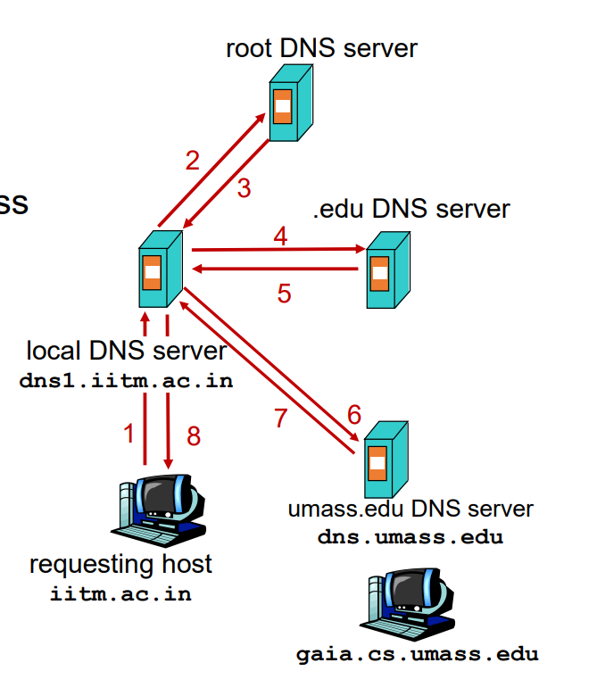

#### Recursive Querying

- Puts burden of name resolution on the contacted name server(eg: root)
- Problem with this is that the root server is burdened with all the queries

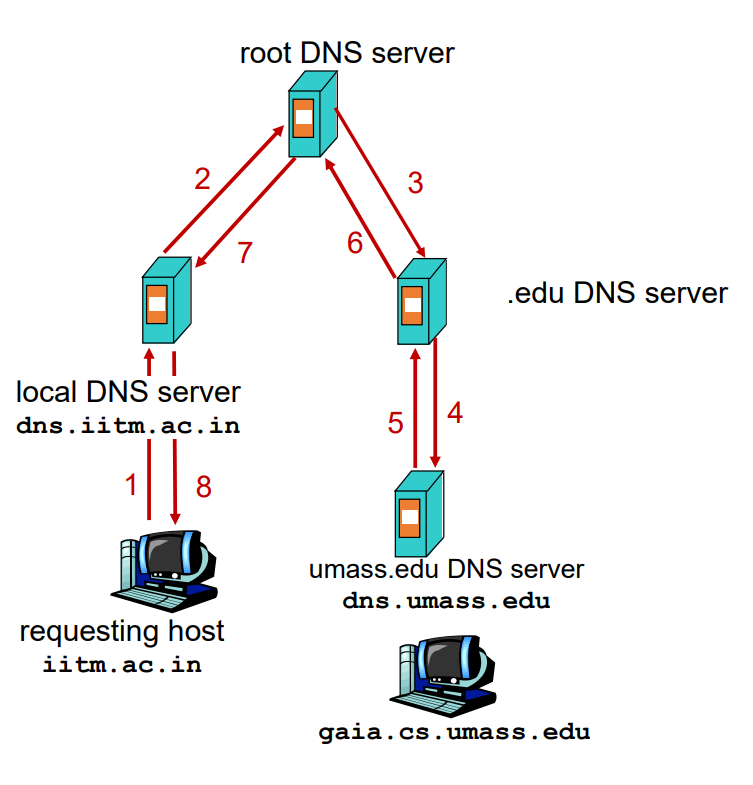

### DNS Caching

- Once any name server learns a name to IP address mapping, it caches the mapping
- Cache entries timeout after a while
- TLD servers typically cached in local nameservers
- In practice, root nameservers are not often contacted!!
- Caching is pervasive in DNS

### Hierarchical Domain Name System

First Local DNS Server

Root -> Top Level Domain -> Second Level Domain -> Authoritative Name Server

- Root: .(dot) 13 Root servers: a.root-servers.net, b.root-servers.net, c.root-servers.net, d.root-servers.net, e.root-servers.net, f.root-servers.net, g.root-servers.net, h.root-servers.net, i.root-servers.net, j.root-servers.net, k.root-servers.net, l.root-servers.net, m.root-servers.net
- Top Level Domain: .com, .org, .net, .edu, .gov, .in, .uk, .au
- Second Level Domain: google.com, facebook.com, iitm.ac.in, mit.edu
- Authoritative Name Server: : <www.google.com>, <mail.google.com>, <www.facebook.com>, <www.iitm.ac.in>, <www.mit.edu>

## Performance Measurement of Networks

### Propagation Delay

- The propagation delay, on the other hand, is the time it takes a bit to propagate from one router to the next
- It is a function of the distance between the two routers, but has nothing to do with the packet's length or the transmission rate of the link.

- Link length / propagation speed of link
- eg: 30kms / 3x 10^8 m/s = 0.1ms

### Bandwidth Delay Product

- Link bandwidth * RTT = BDP
- Number of bits "in flight" at any time

eg: 100Mbps \* 0.1ms = 10Mb
eg: 10Gbps \* 10ms = 100Mb

### Transmission Delay

- The throughput can simply be approximated as the minimum transmission rate along the path between source and destination
- The transmission delay is the amount of time required for the router to push out the packet
- It is a function of the packet's length and the transmission rate of the link, but has nothing to do with the distance between the two routers.
- Packet size / Transmission rate of link
eg: 1000 bits / 100 Mbps = 10mus

### Processing Delay

How long does it take for a switch to process a packet? - Assume to be negligible

Delay consisits of 4 components:  
Transmission delay and Propagation delay are due to link properties  
Queueing delay and Processing delay are due to traffic mix and switch internals

### Queueing Delay

How long does a packet have to sit in a buffer before it is processed?  
Depends on **traffic pattern**:

- Arrival rate at the queue
- Nature of arriving traffic (bursty or not?)
- Transmission rate of outgoing link

Characterized with statistical measures:

- Average queueing delay
- Variance of queueing delay
- Probability Delay exceeds a threshold value

Traffic control for queues exist

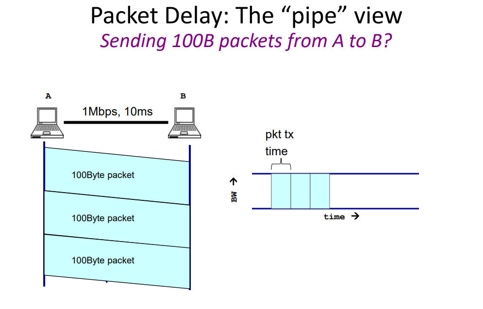

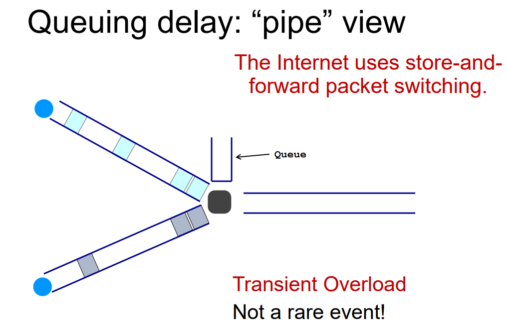
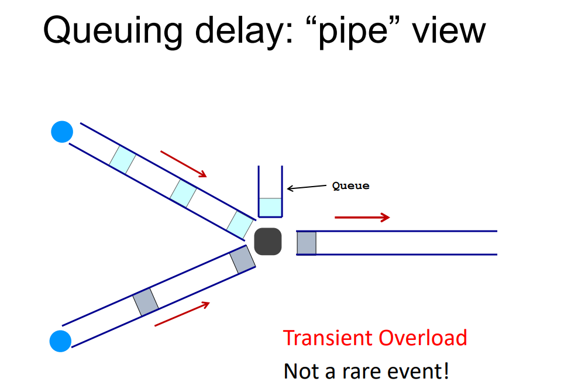
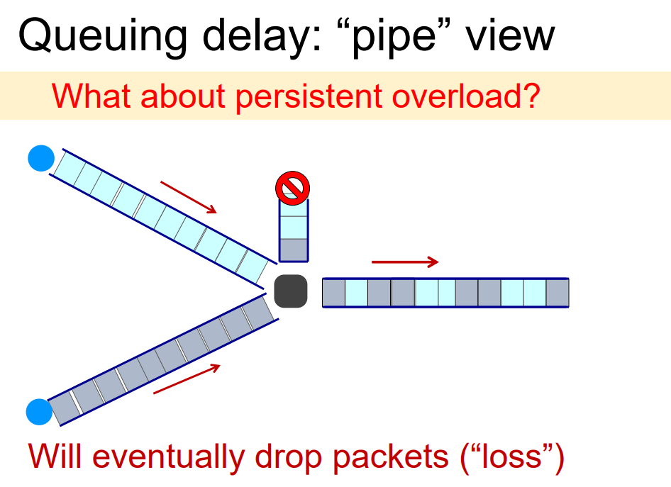

Basic Queuing Theory Terminology:

- Arrival rate: **A**
- Peak rate: **P**
- Average time packets spend in the queue: **W**
- Average number of packets waiting in the queue: **L**

#### Little's Law(John Little, 1961):

- The long term average number *L* of customers that in a stationary system is equal to the long-term average effective arrival rate *A* multiplied by the average time *W* that a customer spends in the system
- The relation is **not affected by the arrival process distribution**(eg: poisson, exponential, gaussian, etc.), the service distribution, the service order or practically anything else. In most queueing systems, service time is the bottleneck that creates the queue

##### L = A * W

### Packet Delay

- Sending 100B packets from A to B at 1Mbps at 1ms
- Transmission delay = 800b/1Mbps = 800mus
- Propagation delay = 1ms
- Inter packet delay is assumed to be 0

Total time = 800mus + 1 ms = 1.8ms  
If we use 1Gbps transmission rate - 1.0008ms Not a lot of improvement

### QoS and QoE

- QoS: **Quality of Service**
  - Bandwidth(Video Streaming), delay, jitter, packet loss
- QoE: **Quality of Experience**
  - Page load time, video quality, call quality (Delay is most important)
  - PDU latency is the delay in the transmission of a Protocol Data Unit (PDU).
  - In video streaming:
    - Having a few pixels wrong is no problem
    - Image stopping and jerking due to delay is not acceptable
  - In a phone call:
    - Variation in delay is most important(Jitter) as adaptive algorithms cannot adapt.
    - Can put up with a bit of noise but cannot put up with delay
  - In a movie download:
    - Reliable byte stream required
  - In text messaging:
    - Acknowledged datagram(Unreliable)  

## Client-Server Architecture

### Server  

- Always on endpoint
- Provides a *service* to the world
- Typically a permanent IP address
- Compute clusters to scale many users

### Client

- A customer of the server
- May be intermittently connected
- May have dynamic IP addresses
- Typically do not communicate directly with other clients

The web and the most mobile apps use a client server architecture

## Peer to Peer architecture

### Peers

- Intermittently connected hosts
- Directly talking to each other
- Little to no reliance on always-up servers. eg: BitTorrent, DC++

Today many applications use a hybrid model

## Socket Programming

- Internet applications reside on multiple endpoints
- Which app on each endpoint? Port number
- Ports are multiplexed by the OS
- Sockets: Abstraction (API) of the internet for applications. Interacts with the transport layer
- Actually OS's kernel network stack communicates with the other OS's network stack
- App layer connection is a 4 tuple: (IP1, port1, IP2, port2). This is what you communicate to the OS

- Step 1 is that the IP address should be *bound* to the port. Some of the ports are reserved and we cant use them
- Step 2 is that it *listens*. Can you always do while(1) listen(); ? Do you have to thread? Interrupt based? Select and poll? Need a concurrent server
- Step 3 is that the client *connects*
- Step 4 is that the pipe is being established
- Step 5 is that the server *accepts* the connection
- Step 6 is that the client *sends*
- Step 7 is that the server *recieves*
- Finite state machine on both sides

Application user send the data down to the next layer using sockets. The lower layer needs to know where to send the data(IP address) and what process gets the data when it is there?(multiplexing)
Identifying the destination:

- Use an IP Address or a hostname(resolve to IP address using DNS)
- Multiplexing(port)
- How to find the remote machine? (IP address, hostname)
- What service on that machine gets the data? (characterized by the port)
- Send, write: receive, read
- Close the socket

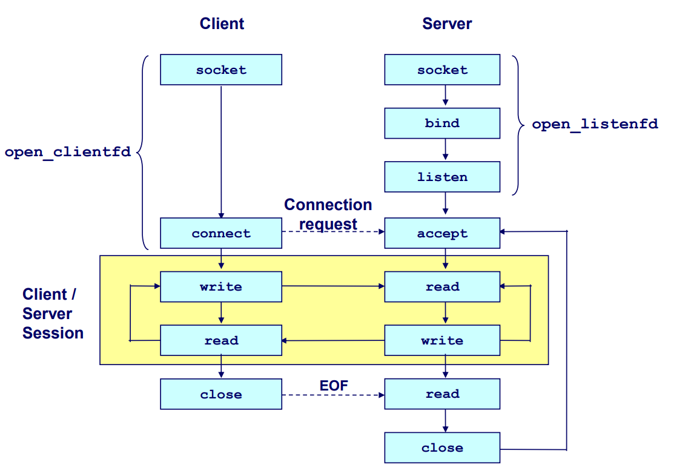

### Step 1: Setup socket **SERVER**

- Both client and server sets up the socket
- Network layer Domain used: AF_INET(IPv4), AF_INET6(IPv6), AF_UNIX(Unix domain sockets)
- type: SOCK_STREAM(TCP), SOCK_DGRAM(UDP): Types of transports:
  - TCP is a reliable type of transport
  - UDP is a best effort type of transport
- protocol: 0. Index number of the transport protocol

```C
int sockfd = socket(AF_INET, SOCK_STREAM, 0);
```

If socket doesnt get made, sockfd = -1

### Step 2: Binding socket to IP address and port **SERVER**

- **int bind(int sockfd, const struct sockaddr *addr, socklen_t addrlen)**
- sockfd: file descriptor returned by socket().
- my_addr:
  - struct sockaddr_in for IPv4
  - cast (struct sockaddr_in*) to (struct sockaddr*) to make the structure less generic
- Returns 0 on success and -1 on error

```C
struct sockaddr_in {
  short sin_family; // AF_INET
  unsigned short sin_port; // Port number
  struct in_addr sin_addr; // IP address
  char sin_zero[8]; // Padding
}
struct in_addr {
  unsigned long s_addr; // IP address
}

struct sockaddr {
    unsigned short sa_family;   // Address family (e.g., AF_INET for IPv4)
    char sa_data[14];           // Protocol-specific address information
};
```

```C
bind(sockfd, (struct sockaddr *)&my_addr, sizeof(myaddr));
```

Why Cast?  

- sockaddr is a generic structure that can be used for any kind of socket
- sockaddr_in is a specific structure for IPv4
- sockaddr_in6 is a specific structure for IPv6

### Step 3: Listening **SERVER**

- **int listen(int sockfd, int backlog);** //backlog is the queue size SUSMAX
- sockfd is the file descriptor returned by socket()
- listen() returns 0 on success and -1 on failure
- backlog is the number of connections that can be queued before the server starts rejecting connections
- This value doesn't limit the total number of connections your server can handle. Instead, it specifies the maximum length of the queue for pending connections that haven't yet been accepted.

```C
listen(sockfd, 5); // After 5 connections, further connect() requests will be refused??? IDTS FAM
```

### Step 4: Accepting **SERVER**

- **int accept(int sockfd, struct sockaddr *addr, socklen_t *addrlen);**
- Server must explicitly accept the connection
- sockfd is the file descriptor returned by socket()
- addr is a pointer to a sockaddr structure that will be filled with the client's address
- addrlen is a pointer to a socklen_t that will be filled with the size of the client's address
- accept() returns a non-negative integer which is the client's file descriptor on success and -1 on failure

```C
int client_fd = accept(sockfd, (struct sockaddr*)&addr, (socklen_t *)&addr_len);
```

#### htons() and htonl() and ntohl() and ntohs()

- IPV6 is 128 bits
- IPV4 is 32 bits (Use htonl())
- Port number is 16 bits (Use htons())
- Any network will expect data to be transmitted in big-endian format

- Network order is big-endian
- Host order can be big or little endian
  - x86 is little-endian
  - SPARC is big-endian
- Hence, we need to convert address, port, etc.

### Step 5: Client Connect **CLIENT**

- **int connect(int sockfd, const struct sockaddr *addr, socklen_t addrlen);**
- sockfd is the file descriptor returned by socket()
- addr is a pointer to a sockaddr structure that contains the server's address
- addrlen is the size of the server's address
- Returns 0 on success and -1 on failure.

```C
inet_pton(AF_INET, "127.0.0.1", &s_address.sin_addr); //Sets the server address value to a binary format of the IP address mentioned

connect(sockfd, (struct sockaddr*)&saddr, sizeof(saddr));
```

### Step 6: Sending **CLIENT/SERVER**

- **ssize_t write(int sockfd, const void *buf, size_t len);**
- **ssize_t send(int sockfd, const void *buf, size_t len, int flags);**

```C
write(sockfd, "Hello", 5);
send(sockfd, "Hello", 5, 0);
```

### Step 7: Receiving **CLIENT/SERVER**

- **ssize_t read(int sockfd, void *buf, size_t len);**
- **ssize_t recv(int sockfd, void *buf, size_t len, int flags);**
- You might not get a `"\n"` at the end of the message
  - For eg: Multiple receives of ```"Hello\n"``` might be received as ```"He"``` and ```"llo\n"```
  - This is due to the way that TCP makes frames. It is a stream oriented protocol where boundaries of packets are not important

```C
char buffer[1024];
read(sockfd, buffer, 1024);
recv(sockfd, buffer, 1024, 0);
```

### Step 8: Closing **CLIENT/SERVER**
Ethernet
- **int close(int sockfd);**
- This may block if there is still data in the sender's buffer
  - Say we close a client connection, the server will still have the data in its buffer and will keep trying to send it
- A solution to this is to use threads
  - Easier to understand but race conditions increase complexity
- select()
  - Explicit control flows and no race conditions
  - More complicated

### Sending data to a DNS Server

```C
struct hostent {
  char *h_name; // Official name of the host
  char **h_aliases; // A pointer to an array of pointers to alternative host names
  int h_addrtype; // The type of address being returned
  int h_length; // The length of the address in bytes
  char **h_addr_list; // A pointer to an array of pointers to network addresses
}

// Finding hostname from IP address
struct hostent *he = gethostbyaddr(&addr, sizeof(addr), AF_INET);

// Finding IP address from hostname
struct hostent *he = gethostbyname("www.google.com", strlen("www.google.com"), AF_INET);
```

## Transport Layer

- Transport layer - TCP and UDP
- Run at end points
  - Sender side breaks app messages into `segments` and passes it into network layer
    - Breaks the application layer messages into smaller chunks and adds its header to it
    - Network layer then attaches its network layer header and calls it a `packet/datagram`
  - Receiver side assembles segments and gives to application layer
- Abstraction between processes
  - Multiplexing and demultiplexing between ports
- Transport layer provides a logical communication between processes running on different hosts while the network layer provides logical communication between hosts
- Logical communication
  - From an application’s perspective, it is as if the hosts running the processes were directly connected; in reality, the hosts may be on opposite sides of the planet, connected via numerous routers and a wide range of link types
- transport protocol can offer reliable data transfer service to an application even when the underlying network protocol is unreliable
- Popularly used in one shot request-reply type queries

- Each IP address comes with a full copy of its own ports
- On the same host, we can simultaneously create a TCP and a UDP socket using the same port number
- TCP and UDP both use the same basic error detecting checksum mechanism

### TCP - Transmission Control Protocol

- Connection based
  - Application remembers the process it was talking to
  - Suitable for long term, contextual data transfer like HTTP, file transfer, etc.
- Guarantees reliability, ordering, congestion control, flow control
- Optimize TCP using internet path? Not possible

#### TCP Header Structure

Total Size = `20B + Options + Data Size`. Can vary from 20B to 60B

- Source Port Number: `16` bits
- Destination Port Number: `16` bits
- Sequence Number: `32` bits
  - The sequence number of the first byte in this segment
- Acknowledgement Number: `32` bits
  - If the ACK flag is set, this field contains the value of the next sequence number that the sender of the segment is expecting to receive
- Data Offset: `4` bits
  - The number of 32-bit words in the TCP header
  - The minimum value for this field is 5, which indicates a 20-byte header
- Reserved: `6` bits
  - Reserved for future use
- Flags: `6` bits
  - URG: Urgent Pointer field significant
  - ACK: Acknowledgement field significant
  - PSH: Push Function
  - RST: Reset the connection
  - SYN: Synchronize sequence numbers
  - FIN: No more data from sender
- Window Size: `16` bits
  - The size of the receive window, which specifies the number of bytes the sender is currently willing to receive
- Checksum: `16` bits
  - Used for error-checking of the header and data
- Urgent Pointer: `16` bits
  - If the URG flag is set, then this 16-bit field is an offset from the sequence number indicating the last urgent data byte
- Options: `Variable` bits
  - The length of this field is determined by the data offset field
  - Options include maximum segment size, window scaling, timestamp, etc.
  - Padding is added to make the header a multiple of 32 bits
- Data: `Variable` bits
  - The data being sent

  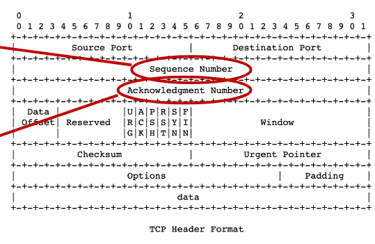

#### Reliable Data Transfer: Stop and Wait

Sender waits for an ACK/RTO before sending another packet

`Packet Loss`

- Receiver sends ACK for every packet received
- Sender waits for ACK before sending the next packet
- If a packet is dropped/delayed
  - Wait for a time period called **RTO(Retransmission Timeout)** before resending the packet
  - RTO is calculated based on the **best estimate of RTT(Round Trip Time)** between the sender
  and receiver
  - If no packet loss: RTT = RTO
    - RTT is the time taken for a packet to travel from sender to receiver and back
  - Retransmission also happens if the ACK is lost/delayed
  - In TCP the sender:
    - Retransmits the lost packet in case of a timeout
    - Calculates the RTO without help from the receiver

`Packet Duplication`

- When an ACK/packet is delayed, there are chances of duplication of packets
- Sender sends a sequence number with each packet
  - For one set of contents of the TCP segment, the sequence number is the same
  - An ACK number also exists
  - Both the sequence number and the ACK number are written in the TCP header
  - TCP sequence numbers can be reused when:
    - The wrap-around-time(Time to exhaust all sequence numbers) is reached - 2^32 / bandwidth
    - All prior packets have reached their expiry time(3 min)

`Packet Corruption`

- A receiver can send a negative acknowledgment(NACK) if a corrupted packet arrives(checksum)
- **TCP uses only positive ACKS**

`Packet Reordering`

- Reordering can happen for:
  - Packets being dropped
  - Packets taking different routes
- Whenever data fits in one packet, no need to reorder packets
- We use:
  - Sequence numbers
  - Receiver Socket Buffers
- TCP software only releases the data to the application if the data is in order relative to all the other data that is already read by the application. **TCP Reassembly**
- Say the receiver window is 5 and it recieves 1, 3, 5. It will release 1 to the application and keep the rest in the buffer. It can accept 6 now, but if 7 arrives, it has to drop it
  - Hence too much reordering can lead to packet loss
    - Data will reach the server but wont be delivered to apps upon recv()

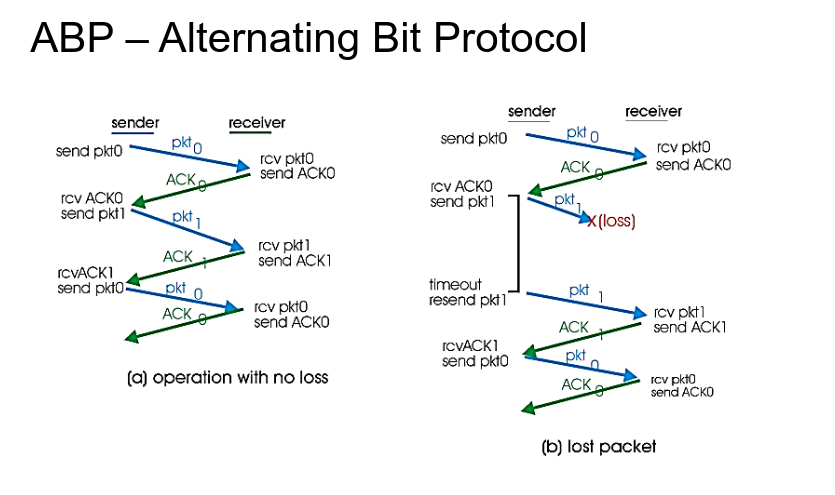

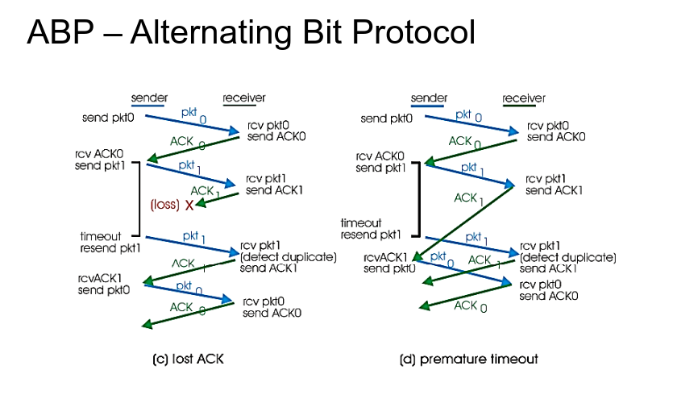

#### Sliding Windows

- Keep many packets in flight to improve throughput
  - Else data rate is limited by the RTT rather than the bandwidth
  - If there are N packets in flight, throughput improves by N times relative to stop-and-wait protocol
    - In stop and wait we send 1 packet per RTT, while in sliding window we send N packets per RTT
- Use the concept of **pipelined reliability**
  - Packets and ACKs transmitted in parallel hence more data is transmitted in a given time
- Receiver has more latest info about the in-flight
  - History at sender is atleast 1 RTT old(Sliding Window)
- Receiver does not accept sequence numbers outside the current window
  - For eg: If window is from 3 to 6 (size = 3), 7 will be rejected and only 3, 4, 5 will be accepted
  
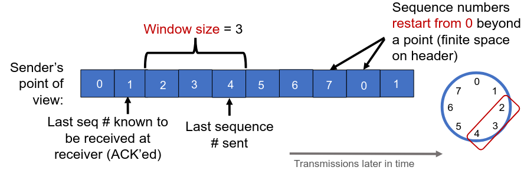

##### Identifying dropped packets

`Go Back N`

- The moment a packet is dropped, the receiver will not accept any more packets until the dropped packet is resent
- The receiver will hence not send any more ACKs until the dropped packet is resent
- The sender will eventually time out and resend all the packets from the dropped packet onwards
- The sender effectively has a window size of N and the receiver has a window size of 1

`Drawbacks of Go Back N`

- It is wasteful as the sender will spend time and network bandwidth resending packets that the receiver has already received


`Selective Repeat`

- The receiver stores all the correct frames that arrive following the bad one
  - The receiver requires a memory buffer for this
    - Each sequence number in its receiving window needs to be stored
    - Apps from the receiver side may not call recv() frequently enough
    - Maximum Window Size = 2^(m - 1), where m is the number of bits in the sequence number as **Sender Window + Reciver Window = 2^m**
  - The sender also needs to maintain a memory buffer for receiving an ACK of that segment before reclaiming that memory
- **Cumulative ACK**: The receiver sends ACKs for the **first in-order sequence numbers it wants to receive/ the highest contiguous sequence number received**
  - Cannot distinguish between isolated losses and multiple losses
  - Eg: If packets 2 and 5 are lost in a window of 1–6:
    - Receiver sends ACK=2 (after packet 1) and ACK=2 again (after packets 3–4).
    - Sender retransmits all packets from 2 onward (2–6), even though packets 3–4 were already received.
    - This leads to unnecessary retransmissions, reducing throughput.

- **Selective ACK**: The receiver sends ACKs for **all the segments it has received**
  - Adds SACK blocks to TCP headers
- The sender eventually times out and resends the unACKed packet(just one packet)
- RTO applies individually to each packet
- While the sender's window is dynamically adjusted, the receiver's window is fixed

- When it receives a checksum error or a frame out of sequence, it transmits a negative acknowledgment(NACK) for the last correctly received frame which stimulates retransmission before the sender's timer expires

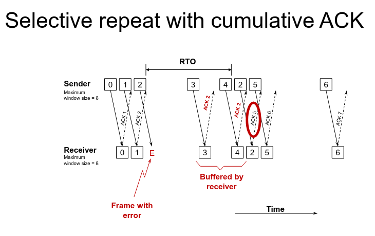

- It takes atleast 2 RTTs

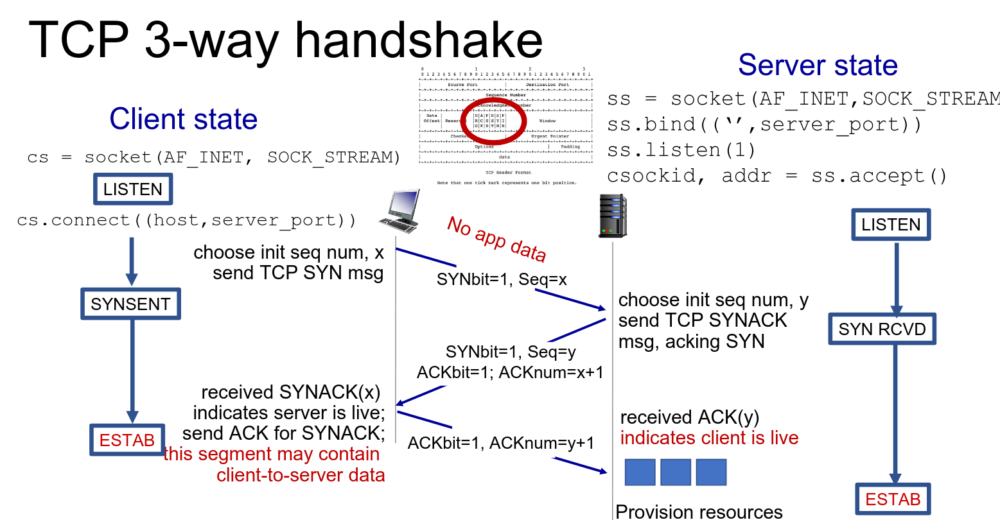

#### Flow Control

- Amount of free buffer at the receiver varies over time and the TCP sender must only send as much as the free buffer space
- Receiver's ACK contains the amount of data the sender can transmit without overflowing the receiver's buffer - **Advertised Window**
- The sender's sliding window cannot be larger than the advertised window
- If the receiver buffer is slow, the advertised window will shrink, shrinking the sender window and slow down the sender
- Default Buffer Size in Linux = sysctl –a | grep net.ipv4.tcp. Around 1MB

#### Congestion Control

- Multiple locations of bottlenecks possible
  - Sender Window
  - Receiver Buffer
  - A network link
  - App reading from the receiver buffer
- Mostly performed at the sender
- Signals to perform congestion control
  - Packets being ACKed
  - Packets being dropped(RTO fires)
  - Packets being delayed(RTO fires)
  - Rate of incoming ACKs

`Ideal Case` (No gap between packets in the bottleneck)

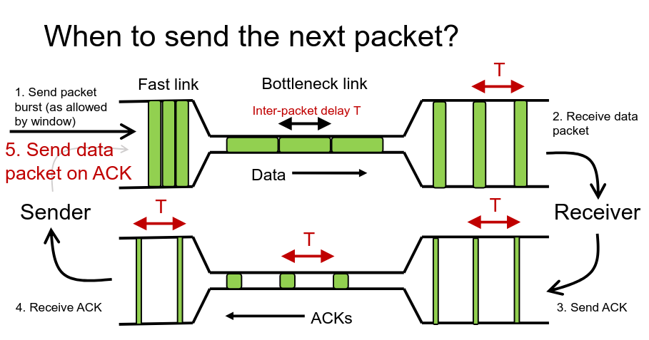

- We ideally want to use the full capacity of the bottleneck and minimize delay(propagation and transmission fixed, so queueing delay should be minimized)
- Strategy: **Packet Conservation Principle**
  - When the sender receives and ACK, it is a signal that the previous packet has left the bottleneck link(and the rest of the network) and it is safe to send another packet without congesting the network.
  - As we use ACKs to signal congestion, this is called **ACK Clocking**

`Not Ideal Case`

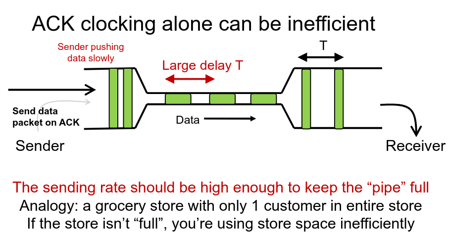

- We need to send at the highest rate possible while being ACK clocked
- There is an unkown bottleneck link rate that the sender must match
  - If sender sends more, packet losses, delays, etc. will occur
  - If sender sends less, the bottleneck link is underutilized

`Default 1 MSS = 1KB????`

`TCP Slow Start`

- Starts slow and increases exponentially
- Upon receiving `an ACK of each MSS`, increase the `cwnd by 1 MSS`(1 then 2 then 4 then 8)
- Basically `double cwnd every RTT`
- On loss(RTO), restart from cwnd = 1MSS
- Increases too rapidly and decreases too rapidly
  - Eg: If the right window size is 17, we go from 16 to 32 and then drop to 1
  - Massive packet losses
  - Unnecessarily low throughput
- Performance keeps increasing and then suddenly becomes very bad. The receiver requests more and more towards the end and results in a big packet loss
- Good algorithm to get close to the bottleneck link rate **fast** when there is no information available about the bottleneck during the starting of the connection
- When close to bottleneck link rate, switch to **congestion avoidance**
  - Perform smaller adjustments to the cwnd

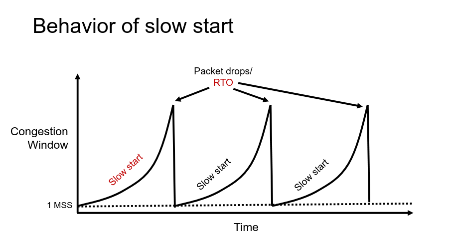

`TCP New Reno: Additive Increase`

- Primary knob is **Congestion Window(cwnd)**
- Primary knob is **packet loss(RTO)**
- The last good cwnd without a packet drop is a good indicator for the slow start threshold(SSTHRESH)
  - Default SSTHRESH = 64KB in TCP
- Do slow start until SSTHRESH
- When the cwnd reaches the SSTHRESH, it enters the congestion avoidance phase
- In the congestion avoidance phase, the cwnd is increased by **1 MSS every RTT**
- When a packet is lost
  - The SSTHRESH is set to **max(2*MSS, cwnd/2)**
  - The slow start phase again begins from cwnd = 1 MSS
- Hence per ACK, we increase by **MSS^2/cwnd = (1/(cwnd/MSS)) * MSS**

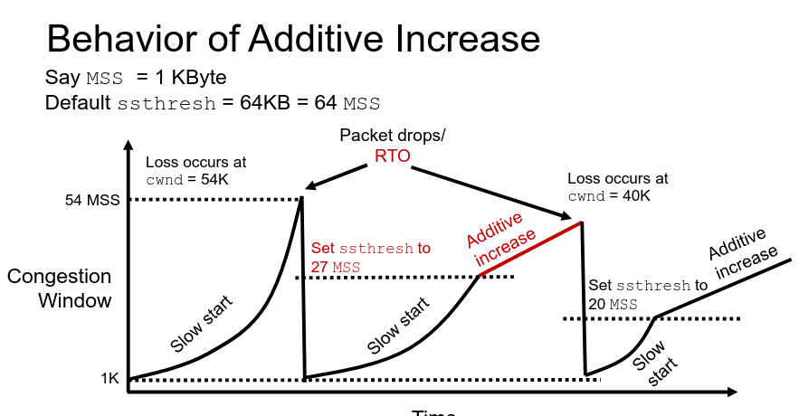

`Fast Retransmit and Fast Recovery`

- Reducing cwnd more gently and not waiting for RTO to expire before retransmitting. We try to see the packet loss coming in advance
- Suppose successive(cumulative) ACKs contain the same ACK number, also called **duplicate ACKs**
  - This occurs when the network is *reordering* packets, or one or more packets were *lost*
- When you see 3 duplicate ACKs, you can assume that the packet is lost (triple duplicate ACK)
  - Make cwnd reduction more gentle than setting it to 1 MSS

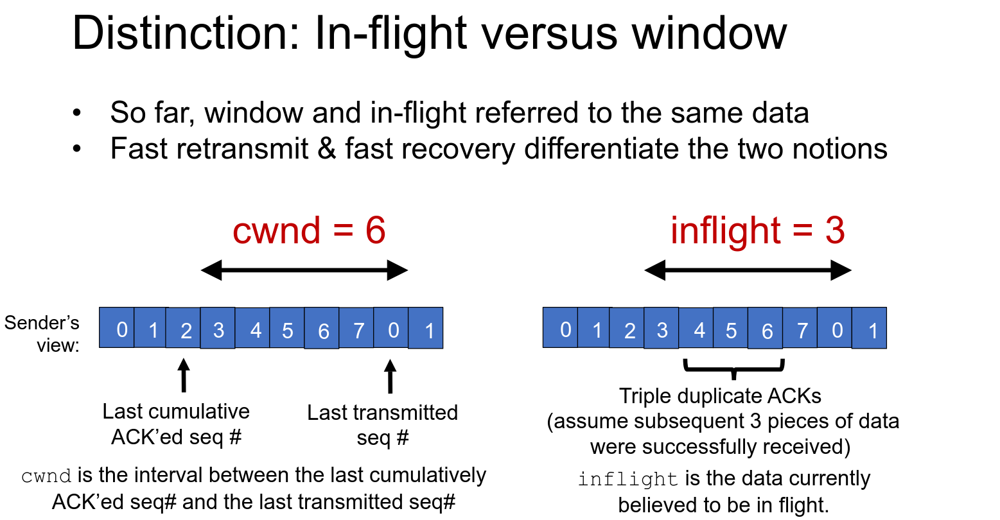

- **Inflight** is actual amount of data already sent but not acknowledged. Here it seems to be 3, 7 and 0
- **Window size** is the usual, maximum amount of data the sender can send without waiting for an ACK. Here it is 6

- Before dup ACKS arrive, we assume **inflight = window**
- **TCP Fast Retransmit**: Reduce the cwnd gently(**Multiplicatively**)
  - Set **inflight = inflight/2**. How do you do that?
    - Set **sstresh = inflight/2**
    - Set **cwnd = ssthresh + 3*MSS**
    - This step is called **Multiplicative Decrease**
  - Then retransmit the sequence number from the dup ACKS **immediately and dont wait for an RTO**
- **TCP Fast Recovery**: Increase the cwnd gently(**Additively**)
  - Sender keeps the reduced inflight until a new ACK arrives which is the ACK for the retransmitted sequence number
  - Sender increases the cwnd by **1 MSS for every dupACK received**
  - When a **new ACK** arrives, deflate cwnd to **half of cwnd before fast retransmit**.
    - Now inflight and window are equal again but they are both half of the original value
  - Perform additive increase from this point onwards

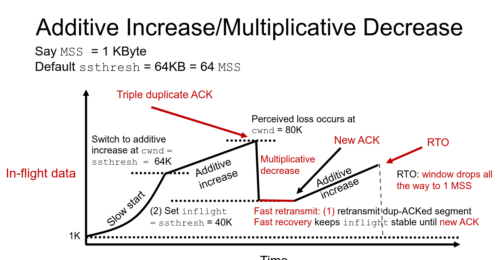

`TCP BBR - Bottleneck Bandwidth and Round-trip propagation time`

- Primary knob is **Sending Rate**
- Primary signal is **ACK arrival rate**
- Send at the **maximum ACK rate measured in the recent past**
  - Update max with bottleneck rate estimates(larger ACK rates)
  - Forget estimates measured a long time ago
  - Incorporated into **rate filter**. WTF IS THIS FILTER DOING

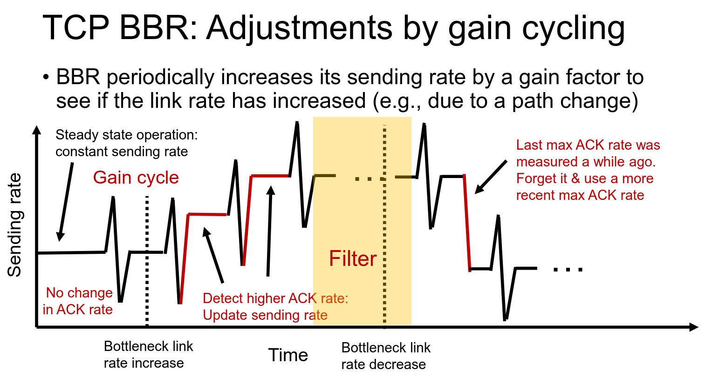

`Getting to steady state`

- Start with slow start, then go to congestion avoidance(TCP Reno or TCP BBR)

##### Sizing the receiver's socket buffer

1. If the receiving app is reading too slowly, no amount of receiver buffer can prevent low throughput
2. If the receiver app is sufficiently fast to read the sender's speed, the receiver must use a buffer of size at least W(sender window size) * MSS(Maximum Segment Size)

#### Interaction between flow and congestion control

- Window to be used = min(Congestion window, Receiver advertised window)
  - For congestion control, window <= congestion window
  - For flow control, window <= receiver advertised window

### UDP - User Datagram Protocol

- Connectionless
  - Suitable for single request or response like DNS or for `loss tolerant delay sensitive` apps like video calling
  - Each UDP segment is handled independently of others
- Guarantees basic error detection
  - Data corruption can be 1 to 0 OR 0 to 1
- A UDP socket can receive datagrams from multiple sources. For receiving by UDP, the socket is common across all sources
- Best effort service. UDP segments may be:
  - Lost
  - Delivered out of order
  - Corrupted along the way
- Simple and low overhead compared to TCP
  - No delays for connection establishment
  - No memory for connection state at sender and receiver
  - Small segment header
  - No congestion control
- Application might implement some reliabilty in addition to UDP
  - Acknowledgement, mimic TCP in UDP maybe
  - Packet that has been delayed for a long time does not have any significance and might as well be lost
- Unreliable connection service is often called **datagram service**
- UDP might take up more energy in OSPF as it has to keep sending the same packet again and again. WTF does this mean

#### UDP Segment Structure

Total Size = `8B + Data Size`

- Source port: `16` bits
- Destination port: `16` bits
- Length: `16` bits
  - Specifies the length of the UDP segment including the header
- Checksum: `16` bits
  - Used for error detection


#### Basic Error Detection

- Have sender compute a function over the *data and headers* and store the result in the checksum field
- Receiver computes the same function over the data and compares it with the checksum field
- If the two values match, the data is assumed to be correct
- Function must be easy to compute
- Function must be easy to verify
- Function must capture frequently ocurring errors

The Function:

`Data Preprocessing`

- Combine the fields from the IP header(contains source address, destination address, protocol and UDP length) and UDP header into a temporary 12-byte structure(4B + 8B)
  - How are we accessing IP header fields? The IP header is passed to the UDP layer by the network layer SUSMAX
  - Can IP headers be accessed from TCP? No
- Concatenate the pseudo header, UDP header and payload data and add a zero byte pad if the byte count is not a multiple of 2 bytes(16 bits)

`Algorithm`

- Sender treats the segment contents as a sequence of 16-bit integers
- Sender adds all the integers together(1's complement sum)
- Sender takes the 1's complement of the sum and puts it in the UDP checksum field

- Receiver does data preprocessing in a similar way as the sender
- Receiver computes the 1's complement sum of the segment contents and the checksum field
- Receiver takes the 1's complement of the sum and checks if the result is 0
- If the result is 0, the segment is assumed to be correct, else it is assumed to be incorrect

`1's Complement Sum`

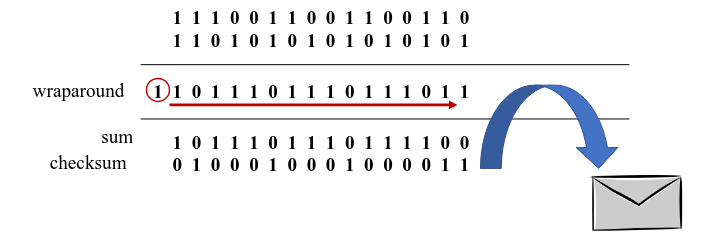

`Drawbacks`

- Cannot detect all errors
  - (x, y) vs (x+1, y-1) will have the same checksum
- Checksum itself can be corrupted
- Checksums do not tell us where the error lies in the segment
  - Checksums cannot be used to correct errors
- Insufficient for reliable data delivery
  - If a packet is lost, so is its checksum

#### Flow Control in UDP

- UDP sockets also have buffers(only at the receiver side) as apps dont call recv() frequently enough
  - In an extreme case the buffer fills up and the UDP segment is dropped
- Redundant recv() calls also cause a drop in performance

### Important Formulae

- **Efficiency/ Link Utilization**: N/(1+2*(dp/dt)) = w/(1 + 2*BDP)
  - N = Window Size
  - dp - Propagation delay
  - dt - Transmission delay
  - Optimal Window Size = (1 + 2*(dp/dt))
  - **N set to 1 for stop and wait**
- **Max Data Rate**: Efficiency * Bandwidth
- **Efficiency of Go Back N using packet error probability p**: 1/(1 + (p*N)/(1-p))
  - Derived from `E[t] = (1-p)dt + p(RTO+E[t])`
    - dt = Transmission delay
    - RTO = N*dt
- **Jain's Fairness Index**: J = (sum of xi)^2 / (N * sum of xi^2)
  - Where xi is the resource allocated to user i and N is the number of users
  - This is a measure of fairness in resource allocation among users

### MIAD - Multiplicative Increase Additive Decrease

- x1 and x2 are two users whose bandwidth allocation are known, we plot x and y axes as x1 and x2.
- A point will represent a bandwidth allocation.
- Zone after which overload occurs = x1+x2=k.
  - The line x1+x2=k is the efficiency line.
  - The line x1=x2 is the fairness line.
  - Intersection of the overload line and fairness line is where we need to be.
- Say we take a point in the underload region and:
  - Do Multiplicative Increase and Multiplicative Decrease(MIMD), it will be oscillating between the two points on the line passing through the origin
  - Do Additive Increase and Additive Decrease(AIAD), it will oscillate between the two points on a line parallel to the fairness line
  - Do Multiplicative Increase Additive Decrease(MIAD), it will move away from the convergence point
  - Do Additive Increase Multiplicative Decrease(AIMD), it will move **towards** the convergence point

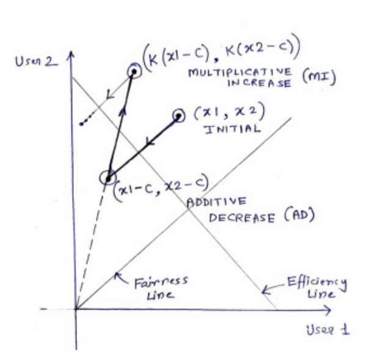

TCP works in terms of bytes. The increase happens like that. not MSS

## Network Layer/IP Layer

- The Internet needs addresses and routers help determine how to move a packet
- The addresses are designed to help routers perform routing functions efficiently
- An IP address corresponds to a point of attachment of an endpoint to a network
- An IP is not an identifier of a host and it changes when the host moves
- IPv4: 32 bits(4 bytes separated by dots)
- IP is like a glue that connects multiple link layers
- AS141340 - Autonomous System. It is in organization that consumes internet but can also carry on traffic
- IP addresses can be reallocated to different routers

### IP Prefixing

- IPs can be grouped based on a shared prefix of a specific length
  - The prefix corresponds to a specific network component
- IP suffixes correspond to the endpoint component of the address
- Using prefixes reduces the amount of information needed to forawrd a packet over the Internet
  - Routers only store the prefix information
- eg: Consider two IPs
  - 128.95.1.80 and 128.95.1.40 has the first 3 parts common, and hence has 8*3 = 24 bits in common
- Identifying prefixes from a 32 bit IP address
  - **Old Method**: IP addresses split into different classes(Classful Addressing) - A, B, C, D, E
    - The class was determined by the first few bits of the IP address
    - Class A: first 8 bits for network, 24 bits for host
    - Class B: first 16 bits for network, 16 bits for host
    - Class C: first 24 bits for network, 8 bits for host
  - **New Method**: CIDR(Classless Inter-Domain Routing)
    - CIDR notation: 192.168.1.0/24, where 24 is the number of bits in the prefix
      - Network component might be 8, 16 or 24 bits long
    - This allows for VLSM(Variable Length Subnet Masking)
    - An ISP can partition an address to its customers
      - Eg: Say an ISP has 128.1.0.0/16, which means it has 2^16 = 65536 addresses and say a customer needs only 64 addresses starting from 128.6.8.128
      - So the customer only needs 6 bits. The allotment can be 128.6.8.128/26 (32-6 = 26)
- IP prefixes are allotted to organizations by Internet registries. But organizations can reallocate IP prefixes to other organizations
- Its possible for an organization to retain its IP block

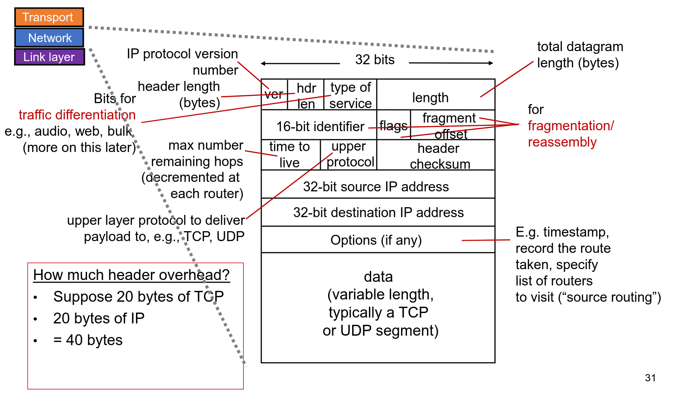

#### Parts of an IP Header

- Minimum Size = `20 bytes` and can go upto `60 bytes` with options

- IP Protocol Version Number: `4` bits
- Header Length: `4` bits
- Type of Service(TOS): `8` bits
  - To differentiate between audio, video, web
- Total Length: `16` bits
- Identification: `16` bits
- Flags: `3` bits
- Fragment Offset: `13` bits
- The last 3 are used for fragmentation/reassembly
- Time to Live(TTL): `8` bits
- Upper Protocol: `8` bits
- Header Checksum: `16` bits
- Source IP Address: `32` bits
- Destination IP Address: `32` bits
- Options: Variable
- Data and Padding: Variable

#### Longest Prefix Matching(LPM)

- Use the longest matching prefix or the most specific routeamong all prefixes that match the packet

#### Netmask or Subnet Mask

- An alternative to denoting the prefix length of an IP
- In the pic, the first 23 bits are 1 denoting the network part of the mask. Hence, the netmask is 255.255.254.0
- So using this mask we can find out if two IPs are from the same network or not
  - Given IPs A and B, compute A AND mask and B AND mask and check if they are equal
  - Here AND is a bitwise operation

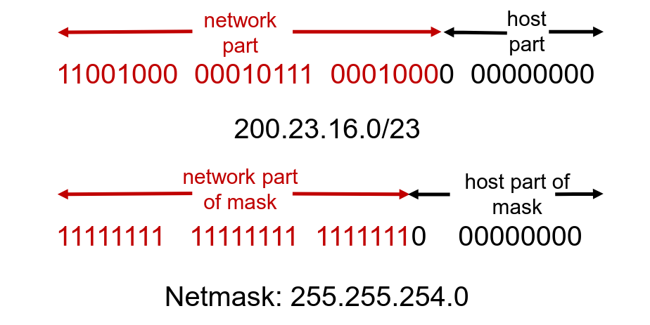

### Routers

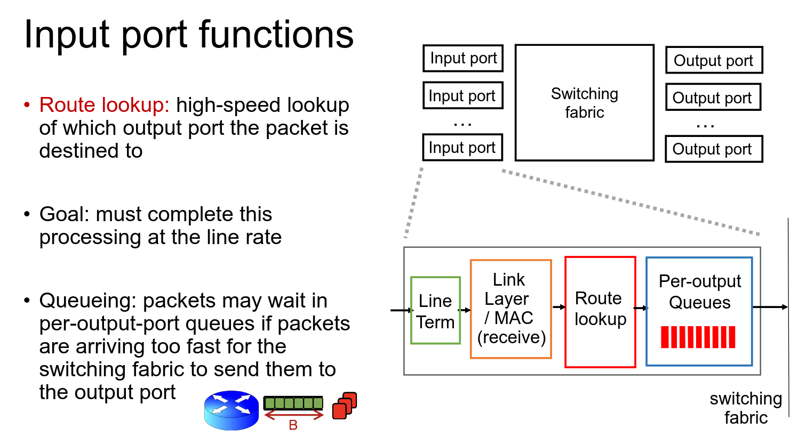

- Line term means termination of the link to the router

- There are different prefixes at different ports on the router. If the destination IP of a packet matches a certain prefix, the packet is forwarded on that port
- The number of table entries in a router is proportional to the number of prefixes and not the number of endpoints(About 1 million prefixes)
- An announcement mechanism exists(BGP - Border Gateway Protocol) by which a ISP broadcasts the prefix it owns
- When an IP block gets reallocated to another ISP, it broadcasts again
- **Routing protocols** must be
  - Determining *good* paths from source to destination
  - *Good* paths are ones with least cost (Paths are sequences of router ports or links)
    - Least propagation delay
    - Lesat cost per unit bandwidth
    - Least conegsted network(workload driven)
  - Resilient to failures
    - Routers and links can fail without taking down the entire network
    - Even if entire subsets are unreachable, the network should still be reachable. Hence the protocol should be **distributed**
- Graph abstraction
  - Each router is a node
  - Each link is an edge
    - Edges have weights/link metrics

#### Link State Protocols

- Each router maintains a complete map of the network
  - Knows the state of all the links and routers in the network
  - Every router performs an independent computation on a globally shared knowledge of the network's complete graph representation
- Messages exchanged by flooding over the entire network
- Communication expensive, but complete
- **Link State Flooding**: The neighbourhood information of each router is transmitted to all other routers
  - Each router sends a **Link State Advertisement(LSA)** to each of its neighbours
    - Each LSA contains the router ID and the IP prefix owned by the router, the router's neighbours and the cost of each link to the neighbours
    - Upon receiving an LSA, a router forwards it to each of its neighbours, except the one it received it from: Flooding
    - Eventually the entire network received the LSA
    - LSAs are put into a link state database
    - LSAs occur periodically when the graph changes
      - Eg: if a link fails
      - Eg: a new router/link is added
    - LSA messages must be sent to all routers in the network at the beginning of Link State protocol
- The routing algorithm on each router can be used to compute least cost paths using the entire network's graph
- Dijkstra's algorithm is used to compute the least cost path from a source router to all other routers in the network
  - This can be used to make the forwarding table at that node
  - Notation:
    - c(x, y): The cost of the link between x and y
    - D(v): The cost of the least cost path from the source to v
    - p(v): The predecessor of v in the least cost path
    - N': Set of nodes whose least cost path is definitively known
- Number of unique LSAs sent at the beginning of the protocol or when the graph changes is N
  - One for each router
- Number of messages sent at the beginning of the protocol or when the graph changes <= NxE or O(NxE)
  - One LSA messsage per router and one edge is only traversed once
- Time for convergence is O(N)??????
  - Each node sends its LSA to all other nodes(which can take a maximum of n-1 steps) and receives LSAs from all other nodes
  
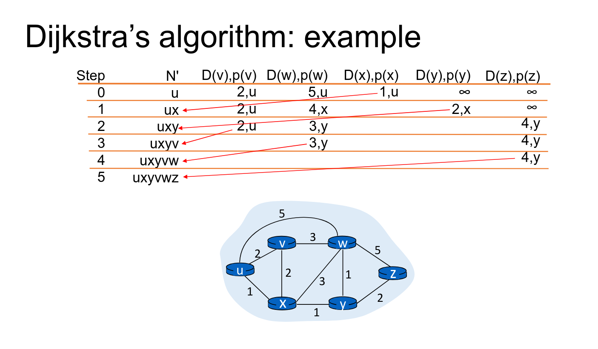

- Constructing the forwaring table:
  - Recursively backtrack the least cost path from the destination to the source using the predecessor table
  - Mark the link from the source to the next node in the path as the next hop for that particular destination

- eg: Open Shortest Path First(OSPF)

#### Distance Vector Protocols

- Each router only exchanges a distance vector with its neighbours which contains the distance to each destination
- Distance Vectors are only exchanged with neighbours
- Messages are exchanged over each link and stay within the link
- Communication is less expensive, but incomplete
- Node x maintains:
  - The distance vector: Dx = (Dx(y1), Dx(y2), ....., Dx(yn))
    - Dx(y): The cost of the least cost path from x to y
  - The cost of edge c(x, y) to its neighbours
  - Its neighbours' distance vectors:
    - [D(y1), D(y2), ....., D(yn)] for each neighbour
- Nodes exchange distance vectors periodically and when the local distance vector changes
- Number of messages sent at the beginning of the protocol or when the graph changes is O(NxE)
  - Number of messages = 2*e, where e is the number of edges in the network
  - For each router (N)
- Time for convergence is 2 timesteps
  - Each node sends its distance vector to its neighbours and receives the distance vectors from its neighbours
  - Each node updates its distance vector based on the received distance vectors

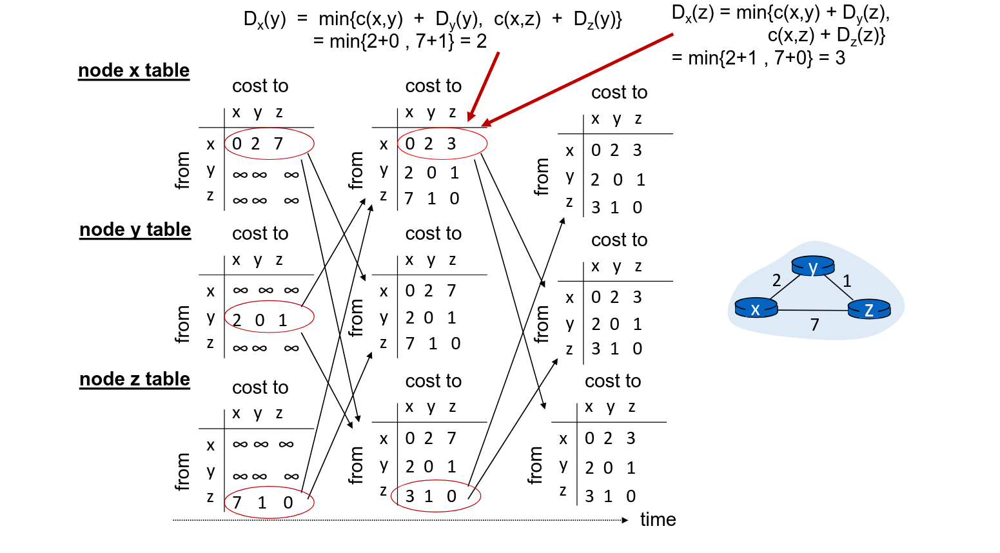

- Good news travels fast
  - Suppose a link cost reduces, the immediate neighbours will sense this change immediately
  - Since their DV changed, their neighbours will sense this change and so on
  - This is despite messages being shared only with neighbours
  - It takes only 2 iterations in time to propagate the change
- Bad news travels slowly
  - Reacting appropriately to bad news requires information that only other routers have
    - B must know that C's path to A is only through B
  - DVs dont exchange paths, only distances
  - **Poison Reverse**: A router will not send a distance vector to its neighbour if the distance to that neighbour is infinity
    - This is to prevent the neighbour from sending a distance vector back to the router
    - But this is not enough to prevent loops in networks of 3 or more routers

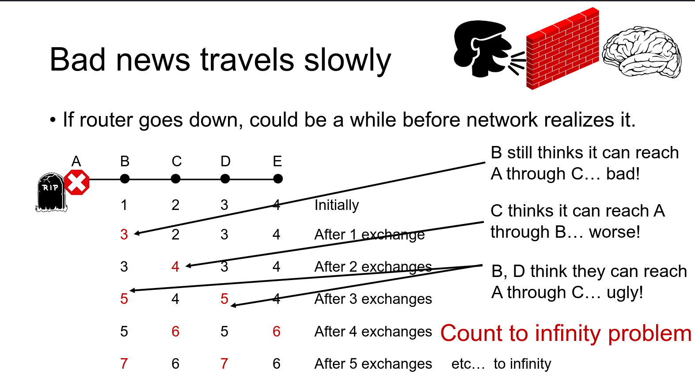

- eg: Enhanced Interior Gateway Routing Protocol(EIGRP), RIP, BGP, ARPAnet

### Support Protocols

- DHCP, ARP(Address Resolution Protocol), OSPF, RIP(Routing Information Protocol), BGP, NAT, IPv6

- Use an IP header underneath their own header or replace the IP header with their own
  - These shouldnt be construed as transport/network protocols
  - They are fundamental to supporting IP/network layer functionality

#### Internet Control Message Protocol (ICMP)

- A protocol for troubleshooting and diagnostics
- IP needs this as the delivery of packets are unreliable
- Some functions:
  - Determine reachability
    - Echo request reply
    - Check for invalid address or port
  - Specify that packets have been in the network for too long
    - Check if a packet's time to live expired(due to routing loops)

##### Ping

- Uses ICMP **echo request (type=8, code=0)** and **reply(type=0, code=0)**
- Source sends ICMP echo request to destination address
- Destination network stack replies with an ICMP echo reply message
- Source calculates RTT of packets
- If no echo comes back, destination is unreachable
- Dont have to have a server program running on the other side

##### Traceroute

- A tool that can record the router level path taken by the packets
- When a router receives a packet, it decreases the TTL field on that packet
- If a router receives a packet with TTL=0, it sends an **ICMP time limit exceeded message (type=11, code=0)** to the source endpoint
- A TTL is a whole number and is decreased/increased by one whole number at each router
- A traceroute sends multiple packets to a destination endpoint, but it progressively increases the TTL on those packets(TTL=1, 2, 3, 4, .....)
- Every time a TTL is received, record the router's IP address
- Process repeated until the destination endpoint is reached
- If the packet reaches a destination endpoint, a **port unreachable message is returned (type=3, code=3)**

#### Network Address Translation (NAT)

- IPv4 address exhaustion
- ISPs dont want to route directly to internal endpoints, just to the gateway
- **Masquerade** and entire network of endpoints using one publicly visible IP address
- The router modifies fields in an IP packet to:
  - Enables communication across networks with different addressing formats and address ranges
- Can change public IP freeely without caring for network local endpoints and changing addresses of devices inside the local network freely without notifying hte rest of the Internet
- If a device outside the Internet is trying to reach a device inside the local network, the NAT router will not know where to send the packet
  - Outbound First Rule: The NAT router will only allow packets to be sent from the local network to the Internet, atleast during initiation of the connection
  - IP/Port forwarding must be configured in the NAT router to allow packets to be sent from the Internet to the local network
- Public IP rn: 103.158.43.16
- Private IP rn: 10.22.20.208
- Number of usable host addresses = 2^(32 - prefix length) - 2
  - 1 reserved for network address, all host bits 0. Starting point of the subnet
  - 1 reserved for broadcast address, all host bits 1. Last address of the subnet
- Port is like the path it takes to go  a destination

Limitations of NAT:  

- Connection limit due to 16 bit port number
  - Only 65536 simultaneous connections possible with a single IP
- Controversial as NATs manipulate the transport layer header, which they are not supposed to do
- Application developers must take NAT into account
  - Eg: FTP, SIP, H.323, etc. use dynamic port numbers and NAT routers cannot keep track of these ports
- Internet *purists* instead just solev the problem by using IPv6

##### Network Address and Port Translation (NAPT)

- The gateway IP is publicly visible and the local endpoint IPs are private
- All datagrams leaving the local network have the same source IP as the gateway
- The NAT gateway router uses a different transport level port for each distinct conversation between the local network and the Internet

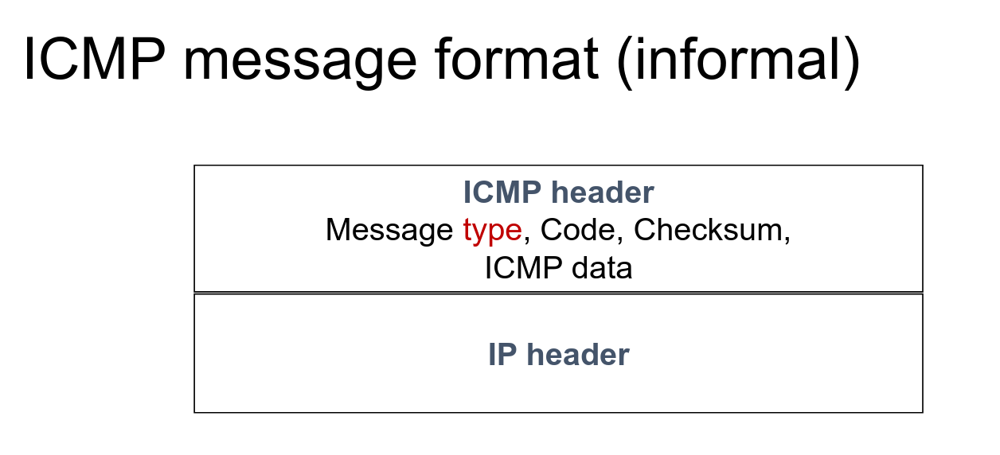

## MAC/Link Layer

- Main function is link local delivery. Responsibilities:
  - Providing a well defined source interface to the network layer
  - Dealing with transmission errors
  - A common situation is when a smart phone requests a Web page from a far more powerful server, which then turns on the fire hose and blasts the data at the poor helpless phone until it is completely swamped.
- Two kinds of link layers
  - **Point to Point**: Switched ethernet link between host and switch. PPP for dial-up ethernet access
  - **Broadcast(shared medium)**: Shared Ethernet. Wireless LAN
- Three kinds of services:
  - Unacknowledged connectionless service: Ethernet, no ACKs and retransmissions with independent frames being sent. Appropriate for real time traffic such as voice, as late data is better than bad data
  - Acknowledged Connectionless Service: Wifi
- On reliable channels, such as fiber, the overhead of a heavyweight data link protocol may be unnecessary, but on (inherently unreliable) wireless channels it is well worth the cost.
- If MAC adresses are unique, why do we need IP addresses?
  - Scope of a MAC address is limited to a LAN
  - MAC addresses are not **hierarchical**.
  - Being hierarchical helps in routing. Cant deploy all of the MAC addresses on one router(on all routers)
  - Scalability: They are specific to the data link layer type
- The usual approach is for the data link layer to break up the bit stream into discrete frames, compute a short token called a checksum for each frame, and include the checksum in the frame when it is transmitted.
- Ethernet/MAC address length(Link Layer) = 14B
  - Destination MAC address: 6B
  - Source MAC address: 6B
  - EtherType: 2B
    - Indicates the type of payload in the frame
- B x log2(1+SNR) is the max bitrate of a link
  - B = Bandwidth of the link
  - SNR = Signal to Noise Ratio

### MAC Protocols

- When there is a single shared broadcast channel, two or more simultaneous transmissions by nodes cause interference
- We say a collision occurs if a node receives two or more signals at the same time
- A MAC protocol is a distributed algorithm that determines how nodes share a channel
- The communication about who shall use the channel must be communicated in that channel only
- Poisson models are used to analyze the performance of MAC protocols. P(k) = G^k * e^(-G) / k!
  - G = average number of packets generated per time unit
  - P(k) = probability of k packets being generated in a time unit
- Ideally, if a link capacity is R:
  - When one node wants to transmit it can send at R
  - When M users want to send at the same time, they can send at R/M
  - Protocol should be fully decentralized with no special nodes to coordinate transmissions and no synchronization of clocks or transmission slots
  - Should be simple
- Three types:
  - Partition channel into time slots or frequency slots and allocate it for exclusive use
  - Turn Taking
  - Random Access, allowing collisions and use methods to recover from collisions
    - The ALOHA protocols were part of ALOHANet one of the first radio networks to be deployed, covering the islands of Hawaii
- Each frame contains a header, payload and a trailer

### Comparison between Links and Routers

- Packet transmission time(microseconds) vs Round Trip Time(milliseconds)
- Link attached to endpoints,while the link is remote/far away from the endpoints
- Link cannot support multiple transmissions as collision results. Router buffer can store simultaneous transmissions for a short period of time
- Collision can be usually detected within a packet transmission period, while detecting congestion takes a round trip time and is indirect

### Slotted ALOHA

- Assumptions:
  - All frames same size
  - Time divided into equal size slots(time to transmit one frame)
  - Devices can only start transmitting at the beginning of a slot, not randomly in the middle
  - All nodes have synchronized clocks and if 2 or more nodes transmit in a slot, all nodes detect collision
- Operation:
  - When node obtains free frame, it transmits in next slot
    - If no collision occurs, the node successfully sends the frame in the next slot and sends another one in the subsequent slot
    - If a collision occurs, the node retransmits the frame in the subsequent slot with a probability p
- Advantages:
  - Single active node can continuously transmit at full rate of channel
  - Simple decentralized protocol
- Disadvantages:
  - Clocks must be synchronized
  - Collision wastes slots, and slots are probably idle when demand exists
  - Must ensure that a collision is detected within a frame duration
  - Even if a collision is detected, the whole frame is wasted
- Efficiency
  - Say the probability of transmitting on failure = p and there are N nodes
  - Probability that a given node has a success in a given slot: **p(1-p)^(N-1)**
  - Probability that any node has success: **Np(1-p)^(N-1)**
    - Need to maximize this
    - We differentiate and equate to 0 giving **p = 1/N**
    - On substituting, we get **(1-1/N)^(N-1)** which tends to 1/e as N tends to infinity
    - Hence, max efficiency = **37%**
    - Each slot has a 37% chance of successful transmission
    - 37% of the channel's capacity is the maximum achievable throughput

### Pure ALOHA

- Simpler than Slotted ALOHA as there is no synchronization
- Transmit a frame immediately as it arrives
- High collision probability as the frame sent at t collides with frames sent in the interval [t-T, t+T], where T is the frame transmission time

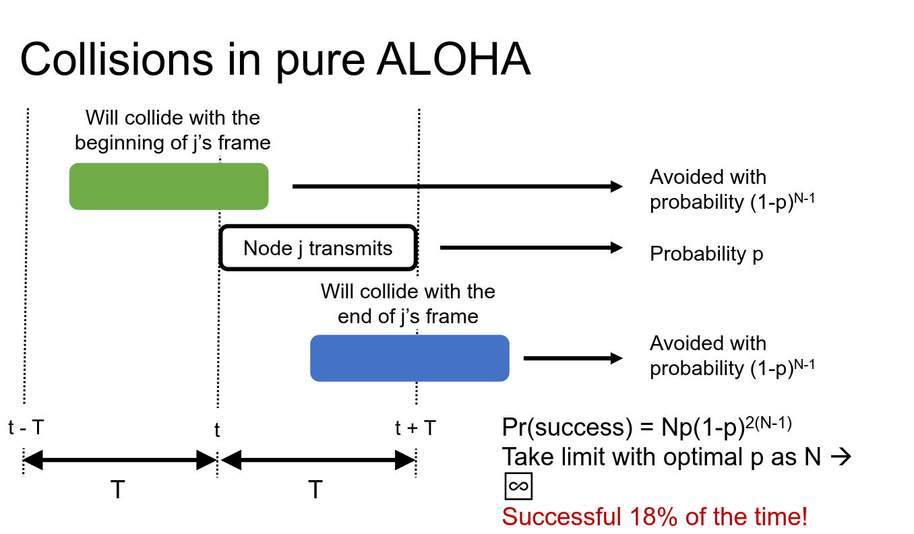

### Carrier Sensing Multiple Acess(CSMA)

- Listen to the channel and dont transmit if channel is busy, else transmit entire frame
- Collisions can still occur as the nodes may not hear each other's transmissions right away due to propagation delay
  - Therefore links cant be very long
- If there is a collision, the entire packet transmission time gets wasted
- There are no time slots here

### Carrier Sensing with Collision Detection(CSMA/CD)

- In **wired** ethernets, detecting collisions can be done quickly
- We compare the transmitted signal to the received signal, if it is more than the transmitted signal, we detect a collision and stop the transmission
  - This reduces channel capacity wastage and improves chances of retransmitting earlier
  - There is a finite collision detect/abort time which is **2τ**, where τ is the propagation delay
- We can think of CSMA/CD contention as a slotted ALOHA system with a slot width of 2τ????????????????????????

### Shared Ethernet - CSMA/CD


- NIC receives data to send and creates a frame
- If NIC detects the channel is idle, it starts frame transmission
  - If NIC transmits entire frame without detecting another transmission, NIC is done with the frame
  - If NIC detects another frame being transmitted, it aborts by sending a **Jam Signal**
    - The NIC waits for some time and attempts to resend the frame(probabilistic like Slotted ALOHA)
    - Wait time/ **Backoff phase**
      - After Mth collision, NIC chooses K at random from {0, 1, 2, ..., 2^m - 1} and waits (K * 512) _bit times_ (time to transmit a single bit)
      - After this, it goes back to the sensing step
      - Waiting longer to transmit is a way of responding to higher load

### Wireless

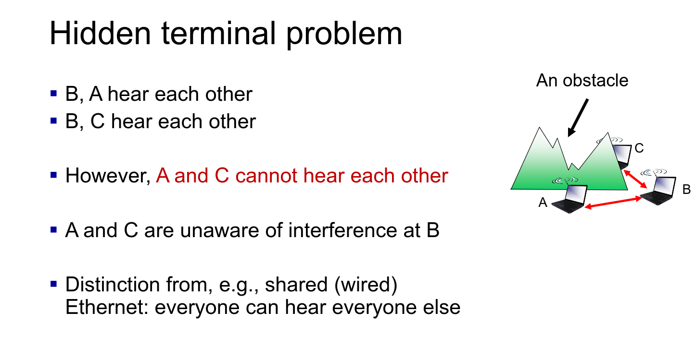
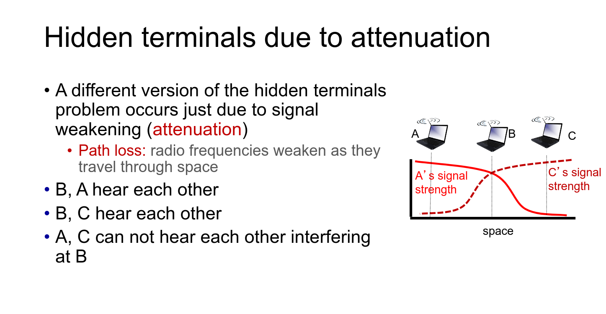
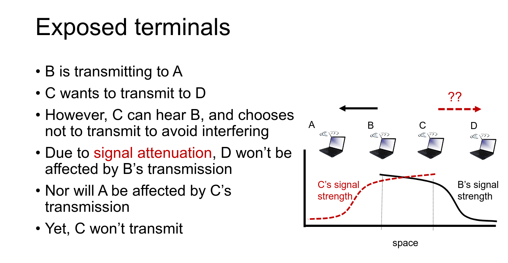

Wireless LANs

- Protocols standardized by the IEEE 802.11 standards
  - eg: 802.11b, 802.11g, 802.11n, 802.11ax
  - A group called Wifi Alliance started to work on interoperability in the 802.11 standard
- Cellular Networks are standardized by a different body(3GPP - Thrd Generation Partnership Project)
- Two frequency spectra: 2.4GHz and 5GHz
- A host associates with an access point(AP) using beacon frames that are periodically transmitted by the AP
- Wireless Multiple Access is done by CSMA/CA

#### CSMA/CA

- The CD part of CSMA/CD is hard in wireless networks as the node's own transmission power is very high as compared to other nodes' transmission at the receiving antenna
- A wireless node cannot receive at a sufficiently high SNR _when its own local transmitter is transmitting_
- Hence we do Collision Avoidance(CA) - Avoid collisions as much as possible

- NIC receives data to send and creates a frame
- If NIC sends channel idle for a fixed time interval(DIFS - Distributed Inter Frame Space), transmit the entire frame
- The protocol requires the receiver to send ACKs on receiving frames
- If no ACK received for a fixed time interval(SIFS - Short Inter Frame Space), increase the random backoff interval and try to send again
- Usually, SIFS < DIFS which means ACKS will mostly be transmitted before fresh data. Also ACKs have higher priority than  fresh transmissions
- If NIC senses that the channel is busy, start the binary exponentiation backoff timer
- The timer only counts down when the channel is free
  - If the channel continued counting down when the channel was busy, the node that started backoff would always get priority
  - This also increases collision probability as all devices might end up finishing the count at the same time
- A wireless medium has higher bit error rates, and therefore waiting for a higher level protocol to correct/ detect the error will waste bandwidth as we need to wait an entire RTT to sense a problem
- As only the problematic link needs to be thought of, retransmitting locally is better
- In CSMA/CA, if the channel is sensed as not free, it enters backoff, but in CSMA/CD it only enters backoff if a collision is detected

OS doees some resource allocation for something something  

The second number in the translated address holds information of the untranslated IP and port. It is the port. We could have also used MAC, but that would be more violation of layers

What is a bloom filter?
- A bloom filter is a space-efficient probabilistic data structure that is used to test whether an element is a member of a set
- It can produce false positives, but not false negatives
- It uses multiple hash functions to map elements to a bit array

ixp()INTERNET EXCHANGE POINTS


Output of a MAC algorithm is whether to send out a packet in the next time step or not

Efficiency of Slottd ALOHA

Net neutrality in a network
SINAR
MAC layer acknowledgement in CSMA/CD
Full duplex in wireless no scene
High propagation loss in wireless

Cannot transmit and receive at the same time in wireless betworks. Need 2 frequencies for uplink and downlink

Shared Ethernet has limited geographical coverage because we cant have 1 big link, as acks take a long rime to come back and if we send a lot together,there is a chance that all will collide

Collision detection only in wired medium as the power is too high to detect in wireless

Buffer bloating ECN

Any wireless transeiver is a radio

Request to Send packet is heard and Clear to Send(Which means bro is not listening from anyobdy else)